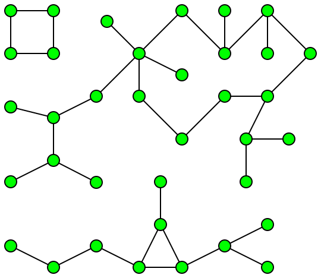

# Storyline Analyzer

This is a java-based storyline analyzer capable of segmenting comic worlds into independent storylines and also provide important statistics.

### Problem Statement:

A comic world is decomposed down into data and we are supposed to calculate relevant statistics and the partition the characters into independent storylines.

The data is a set of nodes (corresponding to each character) and edges, and is provided as a csv file. Two nodes share an edge if they have appeared together in the comic world at any time. For example, lets talk about the Marvel Cinematic Universe. For a long time, Thanos was a part of an independent storyline than that of the avengers (the vanilla heroes: Iron man, Cap, Hulk, Black Widow, etc). Their stories were connected when they appeared together in a small scene of Guardians of Galaxy Vol 2. Similarly, Spider Man and the avengers were also part of independent storylines until they met Captain America: Civil War.

Independent storyline is defined as a set of characters who interact (and their mentions) with other characters in the set only. One could say, that for a long time, the Guardians of the Galaxy and the Avengers were separate storylines. (they were eventually connected too)

### Approach

An undirected graph is created after cleaning and filtering the raw data provided. Each node corresponds to a character of the concerned universe and edges represent inter-dependence/co-occurrence relation among the corresponding characters.

Then the graph is analyzed for further understanding about the size, edge to node ratio (density) etc. I calculate average number of co-occurrences and also rank the nodes according to importance (based on number of unique occurrences).

##### But why?

1) Average co-occurences: This gives us an idea about the density of the graph. And that corresponds to the inter-connectivity of a universe. High average value means that the universe is closely connected and probably requires you to remember stuff from previous comics and movies.

2) Ranking: This tells us about the importance of a character in the universe. A character with a very high number of unique occurrences is bound to be more important to the storyline than the others.

After finding these, I identify independent storylines.

This is simply a problem of finding connected components in an undirected graph. Each component corresponds to one independent storyline. To find the components, I run a DFS over the graph. I make sure that the search continues with a random node after a component is found, insuring the required work is properly done.

   

### Complexity

For ranking, I am using merge sort. The complexity for that part is O(V*logV). For the DFS part, the time complexity is O(E+V).
(V = number of characters, E = number of edges)

Between these two, the sorting part would generally become the bottle neck, and therefore the time complexity for the whole process is O(V*logV).

### How to run

For average co-occurences, use:
~~~
java StorylineAnalyzer.java <nodes file> <edges file> average
~~~

For order of importance, use:
~~~
java StorylineAnalyzer.java <nodes file> <edges file> rank
~~~

For independent storylines use:
~~~
java StorylineAnalyzer.java <nodes file> <edges file> independent_storylines_dfs
~~~
